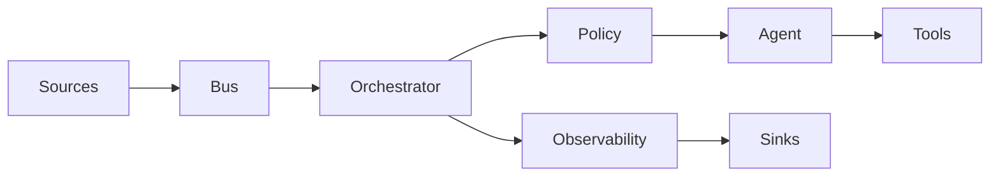
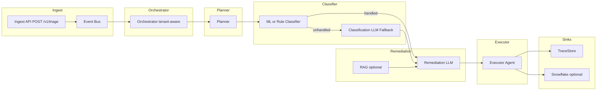

# Architecture

Event-driven, multi-agent stochastic decision system. Data flows in one direction: **Sources → Bus → Orchestrator → Policy/FSM → Agent → Tools → TraceStore** (and optional sinks).

**Intelligent Event Triage (this implementation):** Batch semi-structured error payloads are ingested via API or event bus. The pipeline is **tenant-aware** (True Commerce multi-tenant): request/context carries `tenant_id`; the orchestrator propagates it through Planner → Classifier (ML/rule-based, independently scalable) → Classification LLM fallback when unhandled → Remediation LLM (optional RAG) → Executor. Downstream MCP/Agentic servers are designed to be tenant-aware (routing, RAG, isolation). Components are structured so the Classifier can scale independently.

## Layer Diagram (Mermaid)

Compact view of the stack: one node per layer. Data flows left to right; Orchestrator also feeds Observability.

**Continuity with the triage pipeline:** The diagram below (Intelligent Event Triage Pipeline) is the concrete implementation of the **Agent** (and downstream) layer in this repo. Pipeline "Orchestrator" maps to the Orchestrator layer; Pipeline "Planner / Classifier / Remediation LLM / Executor" is the Agent subgraph; Pipeline "TraceStore / Snowflake" maps to Observability and Sinks. The layer diagram above is the generic stack; the triage pipeline below is this implementation's flow.

## How the Frameworks Complement Each Other

| Piece | Role |
|-------|------|
| **Temporal (stub)** | Durable orchestration: workflow can be replayed, activities are the only place for non-deterministic or I/O-heavy work. This repo uses a deterministic stub; production swaps in Temporal SDK. |
| **Transitions** | Deterministic policy and lifecycle: case state machine, guards, loop limits. No LLM calls here. |
| **PydanticAI** | Agent runtime: structured outputs (Plan/Decision), tool calling, validation. Offline stub model for tests and promptfoo. |
| **DSPy (hook)** | Optimization and program improvement: placeholder interface for prompt/program tuning; not required to run. |
| **promptfoo** | Prompt and output regression: offline runner, schema assertions, fallback and policy-denied cases. |
| **OpenTelemetry** | Spans and attributes for every ingest, orchestrator step, agent run, tool call, fallback, DLQ, replay. No PII in logs. |

## Boundaries and Contracts

- **EventEnvelope / CanonicalEvent** — bus boundary.
- **CaseState / CaseStatus** — orchestrator ↔ policy.
- **Plan / PlanStep / Action** — agent output.
- **ToolCall / ToolResult / ToolError** — tool boundary.
- **TraceEntry** — observability; every step recorded.

All have Pydantic models and a `schema_version` for evolution.

---

## Intelligent Event Triage Pipeline

- **Orchestrator:** Consumes message; extracts and propagates `tenant_id`; drives Planner → Classifier → (Classification LLM if unhandled) → Remediation LLM → Executor.
- **Planner:** Normalizes batch; outputs normalized items with tenant_id.
- **Classifier:** ML- or rule-based component (independently scalable); returns handled/unhandled; unhandled → Classification LLM fallback.
- **Remediation LLM:** Separate LLM; optional RAG (tenant-aware); circuit breaker; deterministic fallback on failure.
- **Executor:** Builds validated TriageResponse; no LLM.
- **Tenant:** `tenant_id` flows through all stages so downstream MCP/Agentic servers can be tenant-aware.

## Agent-first composition

The triage path is **agent-first**: the service composes **Planner → runner → Executor**. The default runner runs the **Triage Orchestrator agent** (`app/agents/orchestrator_agent.py`), which is the single LLM entry point and exposes two tools—`classify` and `remediate`—that delegate to the Classification and Remediation PydanticAI agents ([PydanticAI multi-agent](https://ai.pydantic.dev/multi-agent-applications/) tool-based delegation). The service runs the orchestrator agent with the normalized batch, collects tool-return results from the run, and passes them to the Executor to build `TriageResponse`.

For tests and the promptfoo runner (offline, no LLM), the service accepts an optional **runner** that implements the same interface `(plan, tenant_id) -> (classification_results, remediation_results, used_cf, used_rf)`. The stub runner uses `TriageOrchestrator` (rule-based classifier + stub Classification/Remediation LLMs) and its `run_triage_from_plan` method so no live LLM is called.
